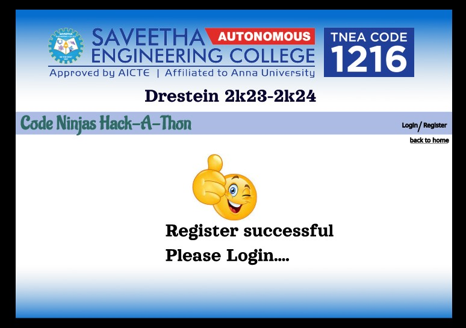

# Event Registration Web Application

## AIM:
To design, develop and deploy a web application for event registration.

## DESIGN STEPS:

### Step 1:

Create a account in figma and create a frame and select any preset size of your choice.

### Step 2:

Import necessary images and start design.

### Step 3:

Link all the webpages that you design.

### Step 4:

View your design webpages by using present icon.

### Step 5:

Fork the repository in your github and clone the repository from your github.

### Step 6:

Validate the HTML and CSS code.

### Step 7:

Publish the website in the given URL.

## DESIGN:

## PROGRAM :

### home page:
```
/*home.html:*/

<div class="home-y3f" id="2:2">
<div class="group-1-ySy" id="8:9">


<p class="drestein-2k23-2k24-p89" id="2:13">Drestein 2k23-2k24</p>
<div class="navbar-Tgu" id="2:14"></div>
<p class="login--PaZ" id="2:17">Login/ </p>
<p class="a-coding-challenge-that-combines-charitable-efforts-and-emphasizes-community-support-and-computer-science-educationa-free-coding-competition-that-aims-to-challenge-inspire-and-celebrate-coders-F6y" id="18:85">A coding challenge that combines charitable efforts and emphasizes community support and computer science education.A free coding competition that aims to challenge, inspire, and celebrate coders.</p>
<p class="register-Rff" id="2:18">Register</p>
<div class="component-1-XTo" id="18:74">
<div class="ellipse-3-PF7" id="18:70"></div>
<div class="auto-group-4f3p-Fo7" id="CQ22xrDEuaw93QTbDa4F3P">?</div>
</div>
<p class="code-ninjas-hack-a-thon-Ufs" id="18:79">Code Ninjas Hack-A-Thon</p>

<div class="component-2-6hF" id="18:92">Log in</div>
<div class="group-2-Zaq" id="18:173">Register</div>
</div>
</div>

/*home.css:*/

.a-coding-challenge-that-combines-charitable-efforts-and-emphasizes-community-support-and-computer-science-educationa-free-coding-competition-that-aims-to-challenge-inspire-and-celebrate-coders-F6y {
  color: #000000;
  font-family: Alatsi, 'Source Sans Pro';
  font-size: 5.5rem;
  font-weight: 400;
  height: 35.2rem;
  left: 4.9rem;
  line-height: 1.28;
  position: absolute;
  top: 44.6rem;
  width: 106.3rem;
}
```

### Register page:
```
/*register.html:*/

<div class="register-q8D" id="18:187">
<div class="auto-group-qx45-4Fs" id="CQ26jQbjXhGPvishdKqX45">

<p class="drestein-2k23-2k24-Exy" id="18:191">Drestein 2k23-2k24</p>
</div>
<div class="auto-group-ah1k-WvV" id="CQ269ku8tJicDvytfWAH1K">
<div class="navbar-qxm" id="18:192"></div>
<p class="login--yZB" id="18:193">Login/ </p>
<div class="line-2-Ezu" id="18:194"></div>
<p class="register-ANm" id="18:195">Register</p>
<p class="back-to-home-sY5" id="18:196">back to home</p>
<p class="code-ninjas-hack-a-thon-mdT" id="18:197">Code Ninjas Hack-A-Thon</p>
<p class="register-4cZ" id="18:198">Register</p>
<p class="name--mms" id="18:199">Name:</p>
<div class="rectangle-2-UgH" id="18:205"></div>
</div>
<div class="auto-group-b441-CcH" id="CQ26qa68XenuqGpqwbB441">
<div class="auto-group-cuop-YAM" id="CQ26RLHWx7mGB8kQJFcuoP">
<p class="department--THK" id="18:200">Department:</p>
<p class="college-name--knD" id="18:201">College Name:</p>
<p class="register-no--UTK" id="18:202">Register No:</p>
<div class="rectangle-3-C8R" id="18:206"></div>
<div class="rectangle-4-w61" id="18:207"></div>
<div class="rectangle-5-4gR" id="18:208"></div>
</div>
<div class="auto-group-eods-CXj" id="CQ26bKzs1BbBNgBZ5Yeods">
<p class="mobile-no--LP3" id="18:203">Mobile No:</p>
<div class="rectangle-6-4K3" id="18:209"></div>
</div>
<div class="group-2-CAM" id="18:233">

<p class="log-in-Ecq" id="I18:235;18:89">Register</p>
</div>
<div class="component-3-x33" id="18:221">
<div class="log-in-Hr1" id="18:222">

<p class="get-otp-zVX" id="18:223">GET OTP</p>
</div>
</div>
</div>
</div>

/*register.css:*/

.register-q8D {
  align-items: flex-end;
  background-color: #ffffff;
  background-image: url('/api/try-prod-ap-southeast-1-first-cluster/projects/BxPQGcrwryMbdUQf8oVXrH/files/vector/ab72f43514755645439f7e7876864f10a3014ccb4d8774d8add6b69166c9c243a61c7e885bc53e21c96c4514d984d0b04f10683e5ad34fe9a1a6aebc2ec3692f?hash=bae6492d05df899d2136a92ed0929c657bee7f9976b38a4a098bcba59eb71c1b');
  background-position: center;
  background-repeat: no-repeat;
  background-size: cover;
  display: flex;
  flex-direction: column;
  overflow: hidden;
  position: relative;
  width: 100%;

  .auto-group-qx45-4Fs {
    align-items: center;
    box-sizing: border-box;
    display: flex;
    flex-direction: column;
    flex-shrink: 0;
    padding: 4.4rem 7.9rem 1rem 12.6rem;
    width: 100%;

    .logo-Kb7 {
      flex-shrink: 0;
      height: 18.9rem;
      object-fit: cover;
      vertical-align: top;
      width: 123.5rem;
    }
    .drestein-2k23-2k24-Exy {
      color: #07002c;
      flex-shrink: 0;
      font-family: Orelega One, 'Source Sans Pro';
      font-size: 6.5rem;
      font-weight: 400;
      line-height: 1.09;
      margin-right: 5.2rem;
      white-space: nowrap;
    }
  }
  .auto-group-ah1k-WvV {
    flex-shrink: 0;
    height: 20rem;
    position: relative;
    width: 144.9rem;

    .navbar-qxm {
      background-color: #abbbe4;
      height: 7.5rem;
      left: 0;
      position: absolute;
      top: 0;
      width: 144.9rem;
    }
    .login--yZB {
      color: #000000;
      cursor: pointer;
      font-family: Aksara Bali Galang, 'Source Sans Pro';
      font-size: 2rem;
      font-weight: 400;
      height: 2.6rem;
      left: 128.6rem;
      line-height: 1.2575;
      position: absolute;
      top: 2.1rem;
      white-space: nowrap;
      width: 5.8rem;
    }
    .line-2-Ezu {
      background-color: #000000;
      height: 0.1rem;
      left: 129.4rem;
      position: absolute;
      top: 10.5rem;
      width: 12.4rem;
    }
    .register-ANm {
      color: #000000;
      font-family: Aksara Bali Galang, 'Source Sans Pro';
      font-size: 2rem;
      font-weight: 400;
      height: 2.6rem;
      left: 135.6rem;
      line-height: 1.2575;
      position: absolute;
      top: 2.2rem;
      white-space: nowrap;
      width: 6.8rem;
    }
    .back-to-home-sY5 {
      color: #000000;
      cursor: pointer;
      font-family: Aksara Bali Galang, 'Source Sans Pro';
      font-size: 2rem;
      font-weight: 400;
      height: 2.6rem;
      left: 129.2rem;
      line-height: 1.2575;
      position: absolute;
      top: 7.2rem;
      white-space: nowrap;
      width: 11.4rem;
    }
    .code-ninjas-hack-a-thon-mdT {
      color: #2e6b64;
      font-family: Aladin, 'Source Sans Pro';
      font-size: 6.3rem;
      font-weight: 400;
      height: 7.8rem;
      left: 2.2rem;
      line-height: 1.225;
      position: absolute;
      top: 0;
      white-space: nowrap;
      width: 56.6rem;
    }
    .register-4cZ {
      color: #000000;
      font-family: Abhaya Libre ExtraBold, 'Source Sans Pro';
      font-size: 6.3rem;
      font-weight: 800;
      height: 8rem;
      left: 2.9rem;
      line-height: 1.2575;
      position: absolute;
      top: 7.7rem;
      white-space: nowrap;
      width: 23.5rem;
    }
    .name--mms {
      color: #000000;
      font-family: Abhaya Libre ExtraBold, 'Source Sans Pro';
      font-size: 6.3rem;
      font-weight: 800;
      height: 8rem;
      left: 40.4rem;
      line-height: 1.2575;
      position: absolute;
      top: 12rem;
      white-space: nowrap;
      width: 18.5rem;
    }
    .rectangle-2-UgH {
      background-color: #d9d9d9;
      border-radius: 5rem;
      height: 7.2rem;
      left: 58.9rem;
      position: absolute;
      top: 12rem;
      width: 52.5rem;
    }
  }
  .auto-group-b441-CcH {
    flex-shrink: 0;
    height: 51rem;
    position: relative;
    width: 100%;

    .auto-group-cuop-YAM {
      height: 24.3rem;
      left: 19.9rem;
      position: absolute;
      top: 0.1rem;
      width: 91.5rem;

      .department--THK {
        color: #000000;
        font-family: Abhaya Libre ExtraBold, 'Source Sans Pro';
        font-size: 6.3rem;
        font-weight: 800;
        height: 8rem;
        left: 3.4rem;
        line-height: 1.2575;
        position: absolute;
        top: 0.5rem;
        white-space: nowrap;
        width: 36.5rem;
      }
      .college-name--knD {
        color: #000000;
        font-family: Abhaya Libre ExtraBold, 'Source Sans Pro';
        font-size: 6.3rem;
        font-weight: 800;
        height: 8rem;
        left: 0;
        line-height: 1.2575;
        position: absolute;
        top: 8.4rem;
        white-space: nowrap;
        width: 40.6rem;
      }
      .register-no--UTK {
        color: #000000;
        font-family: Abhaya Libre ExtraBold, 'Source Sans Pro';
        font-size: 6.3rem;
        font-weight: 800;
        height: 8rem;
        left: 5.5rem;
        line-height: 1.2575;
        position: absolute;
        top: 16.3rem;
        white-space: nowrap;
        width: 34.6rem;
      }
      .rectangle-3-C8R {
        background-color: #d9d9d9;
        border-radius: 5rem;
        height: 7.2rem;
        left: 39rem;
        position: absolute;
        top: 0;
        width: 52.5rem;
      }
      .rectangle-4-w61 {
        background-color: #d9d9d9;
        border-radius: 5rem;
        height: 7.2rem;
        left: 39rem;
        position: absolute;
        top: 8.1rem;
        width: 52.5rem;
      }
      .rectangle-5-4gR {
        background-color: #d9d9d9;
        border-radius: 5rem;
        height: 7.4rem;
        left: 39rem;
        position: absolute;
        top: 16.8rem;
        width: 39.7rem;
      }
    }
    .auto-group-eods-CXj {
      height: 8rem;
      left: 29.1rem;
      position: absolute;
      top: 25.6rem;
      width: 69.5rem;

      .mobile-no--LP3 {
        color: #000000;
        font-family: Abhaya Libre ExtraBold, 'Source Sans Pro';
        font-size: 6.3rem;
        font-weight: 800;
        height: 8rem;
        left: 0;
        line-height: 1.2575;
        position: absolute;
        top: 0;
        white-space: nowrap;
        width: 30.2rem;
      }
      .rectangle-6-4K3 {
        background-color: #d9d9d9;
        border-radius: 5rem;
        height: 7.4rem;
        left: 29.8rem;
        position: absolute;
        top: 0.2rem;
        width: 39.7rem;
      }
    }
    .group-2-CAM {
      cursor: pointer;
      height: 7.4rem;
      left: 53.1rem;
      position: absolute;
      top: 35.3rem;
      width: 26.2rem;

      .rectangle-1-v6M {
        border-radius: 8.7rem;
        height: 7.1rem;
        left: 0;
        object-fit: contain;
        position: absolute;
        top: 0.3rem;
        vertical-align: top;
        width: 26.2rem;
      }
      .log-in-Ecq {
        color: #151212;
        font-family: Aladin, 'Source Sans Pro';
        font-size: 6rem;
        font-weight: 400;
        height: 7.4rem;
        left: 4.1rem;
        line-height: 1.225;
        position: absolute;
        top: 0;
        white-space: nowrap;
        width: 16.7rem;
      }
    }
    .component-3-x33 {
      height: 5.1rem;
      left: 100.4rem;
      position: absolute;
      top: 26.9rem;
      width: 21rem;

      .log-in-Hr1 {
        height: 6.1533rem;
        position: relative;
        width: 100%;

        .rectangle-1-FXw {
          border-radius: 8.7rem;
          height: 5.1rem;
          left: 0;
          object-fit: contain;
          position: absolute;
          top: 0;
          vertical-align: top;
          width: 21rem;
        }
        .get-otp-zVX {
          color: #151212;
          font-family: Aladin, 'Source Sans Pro';
          font-size: 4.6rem;
          font-weight: 400;
          height: 5.7rem;
          left: 3.0414rem;
          line-height: 1.225;
          position: absolute;
          top: 0.4533rem;
          white-space: nowrap;
          width: 14.1rem;
        }
      }
    }
  }
}
```
### Login page:
```
/*login.html:*/

<div class="login-Myb" id="18:129">
<div class="auto-group-g8im-cPj" id="CQ255xLnKpE5ybaofmg8im">

<p class="drestein-2k23-2k24-tPB" id="18:124">Drestein 2k23-2k24</p>
</div>
<div class="auto-group-yjlr-xP3" id="CQ24VZAS8J99w6BZQ3yJLR">
<div class="navbar-V85" id="18:134"></div>
<p class="login--CoB" id="18:135">Login/ </p>
<div class="line-2-tR7" id="18:136"></div>
<p class="register-Psf" id="18:137">Register</p>
<p class="back-to-home-g65" id="18:138">back to home</p>
<p class="code-ninjas-hack-a-thon-NDo" id="18:166">Code Ninjas Hack-A-Thon</p>
<p class="login-Ga5" id="18:167">Login</p>
<p class="name--BBF" id="18:224">Name:</p>
<div class="rectangle-4-HEH" id="18:184"></div>
</div>
<div class="auto-group-tga5-nwj" id="CQ25C2zz3K8vHjb84VTGa5">
<div class="auto-group-xjwx-v2M" id="CQ24kTuFvSGM8zPTeSxjwX">
<p class="register-no--Rzh" id="18:171">Register No:</p>
<div class="rectangle-5-kXB" id="18:185"></div>
</div>
<div class="auto-group-sfah-tdP" id="CQ24sYXo3SZNa5jh7hSfaH">
<p class="mobile-no--pmw" id="18:172">Mobile No:</p>
<div class="rectangle-6-Yhw" id="18:186"></div>
<div class="log-in-ULh" id="I18:225;18:222">

<p class="get-otp-8RF" id="I18:225;18:223">GET OTP</p>
</div>
</div>
<div class="log-in-SB3" id="18:241">

<p class="log-in-sn9" id="18:242">Log in</p>
</div>
</div>
</div>

/*login.css:*/

.auto-group-yjlr-xP3 {
  flex-shrink: 0;
  height: 23.2rem;
  position: relative;
  width: 144.9rem;}

  .navbar-V85 {
    background-color: #abbbe4;
    height: 7.5rem;
    left: 0;
    position: absolute;
    top: 0;
    width: 144.9rem;
  }
  .login--CoB {
    color: #000000;
    font-family: Aksara Bali Galang, 'Source Sans Pro';
    font-size: 2rem;
    font-weight: 400;
    height: 2.6rem;
    left: 128.6rem;
    line-height: 1.2575;
    position: absolute;
    top: 2.1rem;
    white-space: nowrap;
    width: 5.8rem;
  }
  .line-2-tR7 {
    background-color: #000000;
    height: 0.1rem;
    left: 129.4rem;
    position: absolute;
    top: 10.5rem;
    width: 12.4rem;
  }
  .register-Psf {
    color: #000000;
    cursor: pointer;
    font-family: Aksara Bali Galang, 'Source Sans Pro';
    font-size: 2rem;
    font-weight: 400;
    height: 2.6rem;
    left: 135.6rem;
    line-height: 1.2575;
    position: absolute;
    top: 2.2rem;
    white-space: nowrap;
    width: 6.8rem;
  }
  .back-to-home-g65 {
    color: #000000;
    cursor: pointer;
    font-family: Aksara Bali Galang, 'Source Sans Pro';
    font-size: 2rem;
    font-weight: 400;
    height: 2.6rem;
    left: 129.2rem;
    line-height: 1.2575;
    position: absolute;
    top: 7.2rem;
    white-space: nowrap;
    width: 11.4rem;
  }
  .code-ninjas-hack-a-thon-NDo {
    color: #2e6b64;
    font-family: Aladin, 'Source Sans Pro';
    font-size: 6.3rem;
    font-weight: 400;
    height: 7.8rem;
    left: 2.2rem;
    line-height: 1.225;
    position: absolute;
    top: 0;
    white-space: nowrap;
    width: 56.6rem;
  }
  .login-Ga5 {
    color: #000000;
    font-family: Abhaya Libre ExtraBold, 'Source Sans Pro';
    font-size: 6.3rem;
    font-weight: 800;
    height: 8rem;
    left: 2.9rem;
    line-height: 1.2575;
    position: absolute;
    top: 7.7rem;
    white-space: nowrap;
    width: 15.7rem;
  }
  .name--BBF {
    color: #000000;
    font-family: Abhaya Libre ExtraBold, 'Source Sans Pro';
    font-size: 6.3rem;
    font-weight: 800;
    height: 8rem;
    left: 38.8rem;
    line-height: 1.2575;
    position: absolute;
    top: 15.2rem;
    white-space: nowrap;
    width: 18.5rem;
  }
  .rectangle-4-HEH {
    background-color: #d9d9d9;
    border-radius: 5rem;
    height: 7.2rem;
    left: 57.1rem;
    position: absolute;
    top: 15.2rem;
    width: 52.5rem;
  }
```

### regdone.html
```
/*regdone.html:*/

<div class="register-success-iBj" id="18:140">


<p class="drestein-2k23-2k24-d5j" id="18:144">Drestein 2k23-2k24</p>
<p class="login-successful-GeV" id="18:145">Register successful</p>
<p class="login-successful-Ajs" id="18:249">Please Login....</p>

<div class="navbar-QPK" id="18:147"></div>
<p class="login--jgV" id="18:148">Login/ </p>
<p class="register-dWy" id="18:149">Register</p>
<p class="back-to-home-j4D" id="18:150">back to home</p>
<div class="navbar-pbT" id="18:151"></div>
<div class="line-2-LJu" id="18:152"></div>
<p class="code-ninjas-hack-a-thon-fMB" id="18:250">Code Ninjas Hack-A-Thon</p>
</div>

/*regdone.css:*/

.gradient-BzR {
  border-radius: 0.8rem 0.8rem 4rem 4rem;
  height: 160.4357rem;
  left: 0;
  object-fit: contain;
  position: absolute;
  top: 0;
  vertical-align: top;
  width: 194.9rem;
}
```

## OUTPUT:

### Home page:


### Register page:


### Register done page:



### Login page:


### Login done page:


## Result:
Thus the program To design, develop and deploy a web application for event registration is completed successfully.
